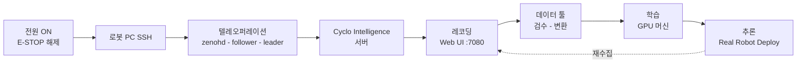

# AI Worker (FFW-SG2) 셋업 및 운용 가이드

[English](README.md) · **한국어**

[ROBOTIS-GIT/cyclo_intelligence](https://github.com/ROBOTIS-GIT/cyclo_intelligence)의 fork입니다. 코드는 upstream 그대로이며, 이 README는 최초 셋업부터 추론까지의 full cycle을 EY PhyAI Lab 운용 기준으로 정리한 문서입니다.

- **[Part 1 — 셋업](#part-1--셋업)**: 최초 1회. 새 로봇이나 새 PC를 준비할 때.
- **[Part 2 — 운용](#part-2--운용)**: 매 세션마다.

ROBOTIS 원본 README는 [docs/UPSTREAM_README.md](docs/UPSTREAM_README.md)에 보존되어 있습니다.

| 단계 | 섹션 | 위치 |
|------|------|------|
| 셋업 | [1. 하드웨어](#1-하드웨어) · [2. 네트워크와 SSH](#2-네트워크와-ssh) · [3. 소프트웨어](#3-소프트웨어) | 로봇, 사용자 PC |
| 운용 | [4. 텔레오퍼레이션](#4-텔레오퍼레이션) · [5. 서버 실행](#5-cyclo-intelligence-서버-실행) | 로봇 PC |
| 데이터 | [6. 레코딩](#6-레코딩) · [7. 데이터 툴](#7-데이터-툴) | 브라우저, 7080 포트 |
| 모델 | [8. 학습](#8-학습) · [9. 추론](#9-추론) | GPU 머신, 로봇 PC |



### 컨테이너 4종

| 컨테이너 | 역할 | 기동 |
|----------|------|------|
| `ai_worker` | 로봇 제어, 텔레오퍼레이션, Zenoh 데몬 | `~/ai_worker/docker/container.sh start` |
| `cyclo_intelligence` | 레코딩 UI, 데이터 툴, 오케스트레이터 | `./docker/container.sh start` |
| `lerobot_server` | LeRobot 학습·추론 백엔드 | `./docker/container.sh start-lerobot` |
| `groot_server` | GR00T N1.7 백엔드 | `./docker/container.sh start-groot` |

policy 컨테이너들은 별도 리포지토리가 아니라 같은 `container.sh`의 서브커맨드입니다.

---

# Part 1 — 셋업

최초 1회입니다. EY PhyAI Lab에서는 이미 완료되어 있으니, 새 장비를 준비하는 경우가 아니면 [Part 2](#part-2--운용)로 넘어가세요.

## 1. 하드웨어

### 1.1 전원 켜기

1. Key switch를 삽입하고 **2시 방향**으로 돌립니다 (FFW-BG2는 12시 방향).
2. **Power 버튼을 3초간** 누릅니다. 비프음이 들리면 전원이 켜진 것입니다.

FFW-SG2 후면 포트: WAN, LAN, USB, HDMI, 충전.

EY PhyAI Lab에서는 상시 전원을 켜두고 charger를 연결해 두므로 이 과정은 거의 필요 없습니다.

### 1.2 E-STOP 해제

빨간 버섯 버튼을 시계방향으로 돌려 튀어나오게 한 뒤 **`A` 버튼**을 누릅니다.

**최초 전원 인가 시 로봇은 torque-off 상태입니다.** `A` 버튼을 눌러야 DYNAMIXEL 통신이 활성화되며, 누르지 않으면 아무것도 반응하지 않습니다.

**주의:** 텔레오퍼레이션/추론 launch 중에는 항상 E-STOP을 손에 쥐고 있을 것. launch 명령이 로봇 팔을 초기 위치로 스스로 움직입니다. 충돌 여부를 주시하며 즉시 정지할 수 있어야 합니다.

**주의:** 베이스를 이동하거나 제자리 회전시키기 전에 charger와 배터리를 분리할 것. 무거운 charger가 끌려다니며 파손될 수 있습니다.

### 1.3 Leader 팔 연결

1. **U2D2** 장치에 전원 어댑터를 연결합니다.
2. U2D2 스위치를 켭니다 — 움푹 들어간 구멍 안에 있으며, 안쪽 흰색 버튼을 누릅니다.
3. U2D2에서 **Follower 후면 USB 포트**로 USB 케이블을 연결합니다.

EY PhyAI Lab에서는 벽면 뒤쪽에 USB 허브가 있어 필요 시 연장 케이블을 씁니다. A-station을 통한 연결이 안 되면 HDMI/키보드를 로봇 PC에 직접 물리는 방법이 있습니다.

### 1.4 Leader 착용

양팔을 어깨끈에 넣고, 가슴 벨트와 힙 벨트 버클을 잠근 뒤, Leader가 단단히 고정되도록 끈 길이를 조절합니다. (최신 버전은 안쪽 벨트를 허리에 조여 잠근 뒤 바깥 벨트를 벨크로로 덧대는 방식입니다.)

## 2. 네트워크와 SSH

### 2.1 접속

**FFW-SG2 (Wi-Fi):** `AIWORKER(번호)` 이름의 Wi-Fi에 접속합니다 — **비밀번호는 네트워크 이름과 동일**합니다. FFW-BG2는 대신 LAN 케이블로 같은 네트워크에 연결합니다.

시리얼 번호는 로봇 후면 패널에 있습니다.

```bash
ssh robotis@ffw-<SERIAL>.local     # 예: ffw-SNPR48A0000.local
# 비밀번호: root
```

`robotis` 계정 하나를 팀이 공용으로 사용합니다. 로봇 PC 설정을 최소로 유지하기 위한 것이니 새 계정을 만들지 마세요.

**주의:** 로봇 PC에서 `apt upgrade`를 실행하지 말 것. 패키지 충돌로 로봇 기능이 죽을 수 있습니다.

### 2.2 SSH alias (권장)

IP를 하드코딩하는 대신 host alias를 쓰면 라우터가 바뀌어도 그대로 씁니다.

```sshconfig
# ~/.ssh/config
Host ai-worker
    HostName ffw-<SERIAL>.local      # 또는 로봇 PC의 IP
    User robotis
    IdentityFile ~/.ssh/id_ed25519_aiworker
```

```bash
ssh ai-worker
```

## 3. 소프트웨어

### 3.1 요구사항

| 항목 | 요구 | 확인 |
|------|------|------|
| OS | Docker Engine이 설치된 Ubuntu | — |
| Docker | 24+ (Compose 포함) | `docker compose version` |
| 디스크 | 최초 기동 전 35GB+ 여유 | `df -h` |
| 포트 | 7080 사용 가능, 또는 `CYCLO_UI_PORT` 지정 | — |
| NVIDIA 드라이버 | `nvidia-driver-570-server-open` (CUDA 12.8) | `nvidia-smi` |
| NVIDIA Container Toolkit | GPU policy 컨테이너에 필요 | — |

Cyclo Intelligence는 public Docker 이미지를 쓰므로 Docker Hub 로그인이 필요 없습니다. UI와 데이터 툴은 no-GPU compose override로 GPU 없이도 돌아가며, GPU는 policy 컨테이너에만 필요합니다.

### 3.2 `ai_worker` 설치 (로봇 제어)

```bash
cd ~/
git clone -b jazzy https://github.com/ROBOTIS-GIT/ai_worker.git
```

이후 업데이트:

```bash
cd ~/ai_worker && git checkout jazzy && git pull
./docker/container.sh stop && ./docker/container.sh start
```

### 3.3 `cyclo_intelligence` 설치 (레코딩·policy)

```bash
curl -fsSL https://raw.githubusercontent.com/ROBOTIS-GIT/cyclo_intelligence/main/install.sh | bash
```

호스트명이 `ffw`로 시작하는 로봇 PC에서는 installer가 체크아웃을 `/mnt/ssd/cyclo_intelligence`에 두고 `~/cyclo_intelligence`로 bind-mount합니다. 그 외에는 `~/cyclo_intelligence`에 바로 설치됩니다.

이후 업데이트:

```bash
cd $HOME/cyclo_intelligence
git pull
git submodule update --init --recursive
```

### 3.4 Zenoh 설정 (컨테이너 내부, 최초 1회)

Zenoh는 로봇과 Cyclo Intelligence 사이의 통신 미들웨어입니다. `cyclo_intelligence` 컨테이너 안에서 설정합니다.

```bash
cd $HOME/cyclo_intelligence
./docker/container.sh start
./docker/container.sh enter
```

로봇과 **같은 머신**일 때:

```bash
echo "export ZENOH_CONFIG_OVERRIDE='transport/shared_memory/enabled=true'" >> ~/.bashrc
source ~/.bashrc
```

**원격 머신(client 모드)** — 로봇 IP가 `192.168.0.42`인 경우:

```bash
echo "export ZENOH_CONFIG_OVERRIDE='transport/shared_memory/enabled=true;mode=\"client\";connect/endpoints=[\"tcp/192.168.0.42:7447\"]'" >> ~/.bashrc
source ~/.bashrc
```

**주의:** 이미 `~/.bashrc`에 있는지 확인하고 추가하세요. `docker restart`는 이 편집을 보존하지만, **컨테이너를 재생성하면 `/root/.bashrc`가 이미지 기본값으로 초기화**되어 다시 설정해야 합니다.

### 3.5 쉘 alias (EY PhyAI Lab 관례)

```bash
# 로봇 PC의 ~/.bashrc
alias ai-worker='cd ~/ai_worker && ./docker/container.sh enter'
```

컨테이너 내부에는 다음 alias가 이미 있습니다: `zenohd`, `ffw_sg2_follower_ai`, `ffw_lg2_leader_ai`, `ffw_sg2_ai`, `cyclo_intelligence`.

---

# Part 2 — 운용

매 세션마다 이 순서로 진행합니다.

## 4. 텔레오퍼레이션

각 단계는 **각각 별도 터미널**에서, SSH 접속 후 `ai_worker` 컨테이너에 진입한 상태로 실행합니다.

```bash
ssh ai-worker
cd ~/ai_worker && ./docker/container.sh start   # 첫 터미널에서만
./docker/container.sh enter                     # 또는: ai-worker
```

**주의:** `stop` 또는 컨테이너 kill은 내부의 모든 노드를 종료시킵니다 — Zenoh 데몬, follower, leader가 전부 함께 닫힙니다. 추론 전에 leader만 끄려면 컨테이너를 kill하지 마세요 ([§9.1](#91-leader부터-끄기)).

EY PhyAI Lab에서는 통합 `ffw_sg2_ai` launch보다 **분리 launch를 선호**합니다. 어느 노드가 죽었는지 추적하기 훨씬 쉽기 때문입니다.

### 4.1 Zenoh 데몬 (터미널 1)

```bash
zenohd        # = ros2 run rmw_zenoh_cpp rmw_zenohd
```

가장 먼저 띄웁니다. 전체 셋업에서 Zenoh 데몬은 딱 하나만 돌아야 하며, 확실치 않으면 `docker ps | grep zenoh_daemon`으로 확인합니다.

### 4.2 Follower (터미널 2)

```bash
ffw_sg2_follower_ai   # = ros2 launch ffw_bringup ffw_sg2_follower_ai.launch.py
```

**주의:** 이 명령은 팔을 config에 정의된 초기 위치로 이동시킵니다. E-STOP을 쥐고 충돌 여부를 주시하세요.

팔 제어, 카메라 스트림, 영상 압축이 함께 올라오므로 시간이 걸립니다. 팔이 리더를 따라 움직이기 시작하면 로그가 끝날 때까지 기다릴 필요 없습니다.

선택 파라미터:

```bash
ffw_sg2_follower_ai launch_cameras:=false init_position:=false
```

### 4.3 Leader (터미널 3)

```bash
ffw_lg2_leader_ai     # = ros2 launch ffw_bringup ffw_lg2_leader_ai.launch.py
```

정상 확인법: kill하면 팔이 그 자리에 멈추고, 다시 launch하면 대응 위치로 복귀(스냅)합니다.

### 4.4 동작 활성화

**양쪽 손잡이 트리거를 2초 이상** 누릅니다. Follower가 리더 자세를 향해 천천히 움직이다가, 오차 범위 안에 들어오면 빠르게 움직입니다. 다시 누르면 일시 중지, `Ctrl+C`로 노드를 정지합니다.

활성화 전에는 로봇이 리더를 따르지 않습니다 — 레코딩 시 토픽이 빨간색인 이유는 대부분 이것입니다 ([§6.2](#62-모든-표시등이-초록색이어야-함)).

그 외 SG2 조작: 그립 버튼으로 그리퍼, 오른쪽 조이스틱으로 상하 리프트, 왼쪽 조이스틱으로 헤드를 제어합니다. 양쪽 스위치를 동시에 누르면 **swerve 모드**입니다 (왼쪽 조이스틱 = linear x/y, 오른쪽 조이스틱 = angular z).

**주의:** swerve 모드에서는 팔이 계속 움직입니다.

### 4.5 텔레오퍼레이션 종료

leader 케이블을 뽑는 것만으로는 **부족합니다.** ROS 2 상의 leader 노드가 살아남아 계속 명령을 브로드캐스트하며, 이후 동작(특히 추론)과 충돌합니다.

1. `Ctrl+C`로 `ffw_lg2_leader_ai` 노드를 종료합니다.
2. 그 다음 leader의 USB-C·전원 케이블을 분리합니다.

## 5. Cyclo Intelligence 서버 실행

텔레오퍼레이션이 살아있는 상태에서, 새 터미널에:

```bash
cd $HOME/cyclo_intelligence
./docker/container.sh start     # 먼저 `docker ps` 확인 — 이미 떠 있으면 생략
./docker/container.sh enter
cyclo_intelligence              # = ros2 launch orchestrator cyclo_intelligence_bringup.launch.py
```

이후 Web UI 접속:

| 접속 위치 | URL |
|-----------|-----|
| 로컬 | `http://localhost:7080/` |
| 원격 | `http://<로봇-IP>:7080/` |
| 호스트명 | `http://ffw-<SERIAL>.local:7080/` |

## 6. 레코딩

### 6.1 로봇 선택

Home 화면에서 **SG2**(`ffw_sg2_rev1`)를 선택합니다. 준비되면 좌측 상단에 `Connected`가 뜹니다. [`shared/shared/robot_configs`](shared/shared/robot_configs)에 config가 있는 로봇만 목록에 나타납니다.

Record 화면은 4개 패널로 구성됩니다: **Camera Views**(SG2는 카메라 4대, 그중 3대가 녹화됨), **Topic Monitor**, **3D Viewer**, **Rosbag Recorder** 패널.

### 6.2 모든 표시등이 초록색이어야 함

처음엔 "leader가 브로드캐스트를 활성화하지 않았다"는 warning과 함께 **빨간색**입니다. 양쪽 트리거를 밀어 로봇을 활성화하면 ([§4.4](#44-동작-활성화)) 초록색으로 바뀝니다. 빨간 상태로 녹화하면 에러가 납니다.

### 6.3 task 메타데이터 입력

| 필드 | 설명 |
|------|------|
| Task Num | task 식별 번호 |
| Task Name | 데이터셋 짧은 식별자, 예: `task_example` |
| Task Instruction | 시연을 자연어로 서술한 지시문 |
| Add License | ROBOTIS 라이선스 포함 (선택) |
| Number of SubTasks | 없으면 `0` |
| Sub Task Instruction | 서브태스크 활성화 시 |

**Task Instruction은 생략하지 마세요.** VLA 모델은 vision과 language를 입력받아 action을 출력합니다 — 지시문은 단순 라벨이 아니라 필수 입력입니다. (문구가 성능에 얼마나 영향을 주는지는 미검증이지만, 반드시 있어야 합니다.)

### 6.4 녹화, 저장, 폐기

조건이 갖춰지면 이미 녹화가 진행 중일 수 있습니다(타임스탬프가 올라감). UI 버튼으로 각 에피소드를 저장/폐기하거나, leader의 버튼을 씁니다: **왼쪽은 취소, 오른쪽은 저장.** 시작/정지는 **Space 키**에도 매핑되어 있어, Space에 연결한 물리 페달로 발 조작이 가능합니다. pause 기능은 없고 start/재시작만 됩니다.

### 6.5 저장 위치

| | 경로 |
|--|------|
| 컨테이너 | `/workspace/rosbag2/<dataset_name>/<episode_index>/` |
| 호스트 | `$HOME/cyclo_intelligence/docker/workspace/rosbag2/<dataset_name>/<episode_index>/` |

각 에피소드에는 `*.mcap`(ROS 2 데이터 본체), `metadata.yaml`, `episode_info.json`, `videos/`, `camera_info/`가 들어갑니다. 녹화할 때마다 episode index가 증가합니다. UI에서는 이 경로가 잘 보이지 않으니, 파일 확인은 호스트 경로로 하세요.

## 7. 데이터 툴

녹화와 학습 사이의 5단계:

```
검수 -> 삭제 -> 병합 -> 변환 -> Hugging Face 업로드/다운로드
```

| 경로 | 내용 |
|------|------|
| `/workspace/rosbag2` | 원본 녹화 (MCAP) |
| `/workspace/lerobot` | 변환된 데이터셋 |
| `/workspace/model` | 모델 체크포인트 |

**Review** — 에피소드가 아니라 task 폴더를 선택한 뒤 각 에피소드를 replay하며, 이상 동작·카메라 누락·잘못된 지시문이 있는 index를 기록합니다.

**Delete** — task 폴더를 선택하고, 삭제할 index를 쉼표로 입력한 뒤(`1, 3, 6, 10`), 번호 재정렬이 필요하면 `Compact indices after delete`를 체크하고 삭제합니다.

**Merge** — 소스 데이터셋을 2개 이상 추가하고, 출력 이름을 지정한 뒤, 미리보기를 확인합니다. EY PhyAI Lab에서는 미검증 기능입니다.

**Convert** — 아래 참조.

### 7.1 LeRobot 포맷으로 변환

녹화 원본은 rosbag2(MCAP)라 학습 프레임워크가 읽지 못합니다. task 폴더를 선택하고 **target FPS**를 설정한 뒤 포맷을 고릅니다. 출력은 `/workspace/lerobot`입니다. 변환 시 지정 FPS에 맞춰 action/observation을 정렬하고 카메라 타임스탬프로 MP4 프레임을 매칭합니다.

| 프레임워크 | 포맷 |
|-----------|------|
| **GR00T (NVIDIA)** | **LeRobot v2.1** — 필수 |
| 그 외 / 최신 LeRobot | **LeRobot v3.0** |

**학습이 깨지는 가장 흔한 원인입니다.** 학습 이미지의 LeRobot 버전과 데이터셋 버전이 불일치하면 학습이 실패합니다. 변환 전에 버전을 맞추세요.

### 7.2 데드타임은 방법이 없음

녹화 시작 직후와 정지 직전의 정지 구간이 그대로 들어갑니다. **trim 기능은 launcher에도, ROBOTIS 제공에도 없습니다.** 자체 개발은 공수 대비 실익이 없으니, 대신 녹화 시 데드타임을 최소화하고 leader 버튼·Space·페달로 start-stop 타이밍을 타이트하게 잡으세요.

### 7.3 Hugging Face

UI보다 CLI를 권장합니다.

```bash
hf auth login                                  # 최초 1회, 본인 토큰으로

# 필요한 서브폴더만 model 경로로 바로 다운로드
hf download <namespace>/<repo> \
  --include "models/<checkpoint_name>/*" \
  --local-dir /workspace/model/lerobot/<local-name>

hf upload <repo_id> <local_path>
```

- `huggingface-cli`는 **deprecated** — `hf`를 쓰세요.
- `hf`는 호스트가 아니라 **컨테이너 내부**에 설치되어 있습니다.
- 데이터가 섞이지 않도록 본인 토큰으로 로그인하세요.

## 8. 학습

ROBOTIS는 학습을 Cyclo Intelligence **밖에서** 수행하며, 모델·GPU·프레임워크 버전에 따라 환경이 달라지므로 고정된 Docker 환경 대신 가이드만 제공합니다. 학습은 로봇 PC가 아니라 **GPU 머신**에서 합니다. 본인 로컬 GPU 머신도 가능하며, 해당 머신에 `cyclo_intelligence`를 설치한 뒤 policy 컨테이너를 띄웁니다.

아래 서브커맨드는 이 저장소의 [`docker/container.sh`](docker/container.sh)에서 확인한 값입니다.

```bash
cd ~/cyclo_intelligence
./docker/container.sh help            # 전체 옵션

./docker/container.sh start-lerobot   # 빌드 + 기동 (idle 상태로 부팅)
./docker/container.sh enter-lerobot   # lerobot_server 내부 쉘

./docker/container.sh start-groot     # GR00T N1.7
./docker/container.sh enter-groot

./docker/container.sh status          # 전 컨테이너 s6-svstat
./docker/container.sh logs            # cyclo_intelligence 로그 tail
./docker/container.sh stop            # compose down
```

| 플래그 / 환경변수 | 의미 |
|------------------|------|
| `--build`, `-b` | 로컬 Dockerfile로 재빌드. 기본값은 Docker Hub의 사전 빌드 이미지 |
| `GPU_ARCH` | `default` 또는 `blackwell` (amd64 전용) |
| `VERSION` | 이미지 태그 (cyclo 기본 `1.2.0`) |
| `CYCLO_UI_PORT` | Web UI 포트 (기본 7080) |

policy 컨테이너는 idle 상태로 부팅하고, orchestrator가 `InferenceCommand.LOAD`를 robot_type과 함께 디스패치할 때 스스로 설정됩니다.

컨테이너에 진입한 뒤 공식 LeRobot 리포지토리의 방식을 참고해 LeRobot / GR00T 학습 명령을 직접 실행합니다.

| | LeRobot | GR00T N1.7 |
|--|---------|------------|
| 컨테이너 | `lerobot_server` | `groot_server` (별도) |
| 데이터셋 포맷 | LeRobot v3.0 | **LeRobot v2.1** |

GR00T는 LeRobot 리포지토리 안에서 돌지 않습니다 — 별도 컨테이너가 정상이며, 설정 오류가 아닙니다.

**공식 LeRobot / Hugging Face 이미지가 아니라 ROBOTIS 커스텀 이미지를 쓰세요** — 공식 이미지는 로봇 데이터와 호환 문제가 생길 수 있습니다. 여기서 LeRobot은 [ROBOTIS-GIT/lerobot-cyclo](https://github.com/ROBOTIS-GIT/lerobot-cyclo) submodule입니다. 또한 ROBOTIS는 **최신 이미지만 제공**하므로, 최신 이미지를 받으면 환경이 미묘하게 달라질 수 있습니다. 최신을 유지하는 것보다 **LeRobot 버전·데이터셋 버전·이미지 버전을 서로 맞추는 것**이 우선입니다.

## 9. 추론

### 9.1 Leader부터 끄기

리더가 살아 있으면 리더의 명령과 정책의 명령이 동시에 로봇에 들어가 충돌합니다. **leader 노드만** 종료하세요 (해당 터미널에서 `Ctrl+C`, [§4.3](#43-leader-터미널-3)). 컨테이너를 kill하면 Zenoh와 follower까지 죽습니다. 리더 팔의 전원을 물리적으로 분리하는 것이 가장 확실합니다.

### 9.2 배포

| 순서 | 내용 |
|------|------|
| 1 | **Inference** 페이지 열기 |
| 2 | 모델 선택 후 백엔드 시작 (ON = policy 컨테이너 생성/시작, Restart = 실패 복구, OFF = 정지) |
| 3 | Policy Path, Task Instruction, Hz, sync/async 설정 |
| 4 | **3D Sim Deploy** — action chunk 1개를 시뮬레이션으로만 실행, 실로봇 명령 차단 |
| 5 | **Real Robot Deploy** — 시뮬 검증 통과 후에만 |

해당 Docker 이미지가 없으면 먼저 pull되니, 컨테이너가 뜰 때까지 기다리세요.

**Sync**는 정책 응답을 기다린 뒤 진행합니다. **Async**는 다음 chunk를 기다리지 않고 요청하며, 추론이 느릴 때는 권장하지 않습니다.

**LeRobot**은 Policy Path에 내보낸 `pretrained_model` 디렉토리를 지정하고, 언어 조건부면 Task Instruction을 넣습니다. **GR00T N1.7**은 checkpoint 폴더를 선택하고 Task Instruction을 입력하며, 필요 시 TensorRT를 활성화합니다.

### 9.3 Policy Path 함정

이 필드는 **전체 HF URL을 거부합니다** — 브라우저 URL을 붙여넣으면 `Repo id must be in the form 'repo_name' or 'namespace/repo_name'`로 실패합니다. 체크포인트를 먼저 다운로드한 뒤 ([§7.3](#73-hugging-face)), `config.json`과 `model.safetensors`가 실제로 들어있는 폴더를 입력하세요.

```bash
find /workspace/model/lerobot -name config.json
```

조용히 실패하는 불일치가 두 가지 더 있습니다.

- **Model 드롭다운과 Policy Path.** Model이 `ACT`인데 Diffusion 체크포인트를 가리키면 잘못된 policy head를 조용히 로드할 수 있습니다.
- **Inference Hz.** 해당 체크포인트의 `train_config.json`에서 fps와 chunk_size를 읽어 맞추세요. 다른 모델의 값을 그대로 물려쓰지 마세요.

---

## 부록 A. 치트시트

```bash
# 접속
ssh ai-worker                                   # = ssh robotis@ffw-<SERIAL>.local  (pw: root)

# ai_worker 컨테이너
cd ~/ai_worker && ./docker/container.sh start|enter|stop|help

# 텔레오퍼레이션 — 각각 별도 터미널, 컨테이너 내부
zenohd                                          # ros2 run rmw_zenoh_cpp rmw_zenohd
ffw_sg2_follower_ai                             # + launch_cameras:=false init_position:=false
ffw_lg2_leader_ai
ffw_sg2_ai                                      # 통합 (비선호)
#   활성화: 양쪽 트리거 2초 이상 | 정지: Ctrl+C

# Cyclo Intelligence
cd ~/cyclo_intelligence
./docker/container.sh start && ./docker/container.sh enter
cyclo_intelligence                              # UI: http://ffw-<SERIAL>.local:7080/

# policy 컨테이너 (GPU 머신)
./docker/container.sh start-lerobot | enter-lerobot
./docker/container.sh start-groot   | enter-groot
./docker/container.sh status | logs | stop
#   --build/-b 는 pull 대신 로컬 빌드

# 데이터 경로
#   호스트    : ~/cyclo_intelligence/docker/workspace/rosbag2/<dataset>/<episode>/
#   컨테이너  : /workspace/rosbag2 (원본) | /workspace/lerobot (변환) | /workspace/model

# Hugging Face (컨테이너 내부)
hf auth login
hf download <namespace>/<repo> --include "models/<ckpt>/*" \
  --local-dir /workspace/model/lerobot/<local-name>

# lerobot_server 디버깅
docker exec -it lerobot_server bash
/lerobot/.venv/bin/python3 -c "import torch; print(torch.__version__, torch.cuda.is_available())"
/lerobot/.venv/bin/pip install <pkg>            # 반드시 venv 타겟
docker restart lerobot_server                   # writable-layer 변경 보존
```

## 부록 B. 트러블슈팅

| 증상 | 원인과 조치 |
|------|-------------|
| Topic Monitor 빨간색 | 로봇 미활성화. 양쪽 트리거를 2초 이상 눌러 모든 표시등이 초록이 될 때까지 |
| 전원을 켰는데 아무 반응 없음 | torque-off 상태. 리모트 E-STOP의 `A` 버튼을 누를 것 |
| launch 시 팔이 스스로 움직임 | 정상 — 초기 위치 자동 이동. E-STOP 준비, 원치 않으면 `init_position:=false` |
| Leader가 죽은 것 같음 | kill하면 팔이 멈추고, 재launch하면 대응 위치로 복귀하는지 확인 |
| 추론 중 로봇이 이상함 | Leader가 아직 살아 있음. leader 노드만 종료, 컨테이너 kill 금지 |
| 에피소드 앞뒤 정지 구간 | trim 기능이 없음. leader 버튼이나 페달로 타이밍을 조일 것 |
| `huggingface-cli` deprecated | `hf` 사용 — 같은 플래그, 새 이름 |
| `hf` not found | 호스트가 아니라 컨테이너 내부에 있음 |
| `Repo id must be in the form...` | Policy Path에 HF URL 붙여넣기 금지. 먼저 다운로드 후 로컬 폴더 경로 입력 ([§9.3](#93-policy-path-함정)) |
| 학습이 깨짐 / 호환 안 됨 | LeRobot 버전(2.1 vs 3.0)·데이터셋 버전·이미지 버전 불일치. 정렬할 것 ([§7.1](#71-lerobot-포맷으로-변환)) |
| GR00T가 LeRobot repo에서 안 돌아감 | 정상 — `groot_server`에서 실행됨 |
| `'diffusers' is required but not installed` | venv에 설치: `/lerobot/.venv/bin/pip install 'lerobot[diffusion]'`. 일반 `pip install`은 반영 안 됨 |
| venv 설치가 사라짐 | writable layer는 `docker restart`엔 살아남지만 컨테이너 재생성 시 소실. 영구화하려면 `cyclo_brain/policy/lerobot/Dockerfile.${ARCH}`에 extra 추가 |
| Zenoh 설정이 사라짐 | 컨테이너 재생성 시 `/root/.bashrc`가 리셋됨. [§3.4](#34-zenoh-설정-컨테이너-내부-최초-1회) 재적용 |
| 베이스 이동 후 charger 파손 | 이동 전 charger·배터리 분리, 이동 후 재연결 |

실제 추론 디버깅 사례 — `diffusers` 누락, 의도치 않은 torch 교체, venv 이슈 — 는 [docs/session-log-inference-debug.md](docs/session-log-inference-debug.md)에 정리되어 있습니다.

## 참고 링크

**ROBOTIS 공식 문서**

- Imitation Learning: [Setup](https://docs.robotis.com/docs/systems/omy/imitation_learning/setup) · [Data Recording](https://docs.robotis.com/docs/systems/omy/imitation_learning/data_recording) · [Data Tools](https://docs.robotis.com/docs/systems/omy/imitation_learning/data_tools) · [Model Training](https://docs.robotis.com/docs/systems/omy/imitation_learning/model_training) · [Model Inference](https://docs.robotis.com/docs/systems/omy/imitation_learning/model_inference)
- AI Worker Quick Start: [Hardware](https://docs.robotis.com/docs/systems/aiworker/quick_start_guide/setup_overview/hardware) · [Software](https://docs.robotis.com/docs/systems/aiworker/quick_start_guide/setup_overview/software) · [Teleoperation](https://docs.robotis.com/docs/systems/aiworker/quick_start_guide/operation_guide/teleoperation)

**저장소**

- Upstream: [cyclo_intelligence](https://github.com/ROBOTIS-GIT/cyclo_intelligence) · [ai_worker](https://github.com/ROBOTIS-GIT/ai_worker) · [lerobot-cyclo](https://github.com/ROBOTIS-GIT/lerobot-cyclo) · [Isaac-GR00T-n1.7](https://github.com/ROBOTIS-GIT/Isaac-GR00T-n1.7)
- 모델·데이터셋: [huggingface.co/ROBOTIS](https://huggingface.co/ROBOTIS)

## 라이선스

Upstream 라이선스를 따릅니다 — [LICENSE](LICENSE) 참조.
