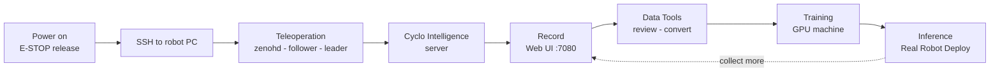

# AI Worker (FFW-SG2) Setup and Operation Guide

**English** · [한국어](README.ko.md)

Fork of [ROBOTIS-GIT/cyclo_intelligence](https://github.com/ROBOTIS-GIT/cyclo_intelligence). Code is unchanged from upstream; this README documents the full cycle from first-time setup to inference, as operated at the EY PhyAI Lab.

- **[Part 1 — Setup](#part-1--setup)**: one-time, on a new robot or a new PC.
- **[Part 2 — Operation](#part-2--operation)**: every session.

Upstream's original README is preserved at [docs/UPSTREAM_README.md](docs/UPSTREAM_README.md).

| Step | Section | Where |
|------|---------|-------|
| Setup | [1. Hardware](#1-hardware) · [2. Network and SSH](#2-network-and-ssh) · [3. Software](#3-software) | Robot, your PC |
| Operate | [4. Teleoperation](#4-teleoperation) · [5. Start the server](#5-start-the-cyclo-intelligence-server) | Robot PC |
| Data | [6. Recording](#6-recording) · [7. Data Tools](#7-data-tools) | Browser, port 7080 |
| Model | [8. Training](#8-training) · [9. Inference](#9-inference) | GPU machine, robot PC |



### The four containers

| Container | Role | Start with |
|-----------|------|------------|
| `ai_worker` | Robot control, teleoperation, Zenoh daemon | `~/ai_worker/docker/container.sh start` |
| `cyclo_intelligence` | Recording UI, data tools, orchestrator | `./docker/container.sh start` |
| `lerobot_server` | LeRobot training and inference backend | `./docker/container.sh start-lerobot` |
| `groot_server` | GR00T N1.7 backend | `./docker/container.sh start-groot` |

The policy containers are subcommands of the same `container.sh`, not separate repositories.

---

# Part 1 — Setup

One-time. At the EY PhyAI Lab this is already done — skip to [Part 2](#part-2--operation) unless you are provisioning a new machine.

## 1. Hardware

### 1.1 Power on

1. Insert the key switch and turn it to the **2 o'clock position** (FFW-BG2 uses 12 o'clock).
2. Hold the **Power button for 3 seconds**. A beep confirms power-on.

FFW-SG2 rear ports: WAN, LAN, USB, HDMI, charge.

At the EY PhyAI Lab the robot stays powered on with the charger connected, so this is rarely needed.

### 1.2 Release the E-STOP

Turn the red mushroom button clockwise until it pops out, then press the **A** button.

**On first power-up the robot is torque-off.** Pressing `A` is what enables DYNAMIXEL communication — without it nothing responds.

**Warning:** keep the E-STOP in hand during any teleoperation or inference launch. The launch commands move the arms to their initial pose on their own. Watch for collisions and be ready to stop.

**Warning:** disconnect the charger and battery before moving or rotating the base. The charger gets dragged along and can be damaged.

### 1.3 Connect the leader arm

1. Connect the power adapter to the **U2D2** device.
2. Turn on the U2D2 switch — it sits in a recessed hole; press the inner white button.
3. Connect a USB cable from the U2D2 to a **USB port on the back of the follower**.

At the EY PhyAI Lab there is a USB hub behind the wall panel; use extension cables as needed. If the A-station connection fails, attach HDMI and a keyboard directly to the robot PC as a fallback.

### 1.4 Wear the leader

Put both arms through the shoulder straps, fasten the chest and hip buckles, and adjust the straps until the leader is held firmly in place. (Newer units use an inner belt tightened around the waist, with an outer velcro belt over it.)

## 2. Network and SSH

### 2.1 Connect

**FFW-SG2 (Wi-Fi):** join the Wi-Fi network named `AIWORKER(Number)` — **the password is the network name itself**. FFW-BG2 uses a LAN cable to the same network instead.

The serial number is on the robot's back panel.

```bash
ssh robotis@ffw-<SERIAL>.local     # e.g. ffw-SNPR48A0000.local
# password: root
```

The team shares the single `robotis` account. Do not create new accounts — the robot PC is deliberately kept minimally configured.

**Warning:** never run `apt upgrade` on the robot PC. Package conflicts can disable robot functionality.

### 2.2 SSH alias (recommended)

A host alias keeps working when the router changes, unlike a hardcoded IP.

```sshconfig
# ~/.ssh/config
Host ai-worker
    HostName ffw-<SERIAL>.local      # or the robot PC's IP
    User robotis
    IdentityFile ~/.ssh/id_ed25519_aiworker
```

```bash
ssh ai-worker
```

## 3. Software

### 3.1 Prerequisites

| Item | Requirement | Verify |
|------|-------------|--------|
| OS | Ubuntu with Docker Engine | — |
| Docker | 24+ with Compose | `docker compose version` |
| Disk | 35 GB+ free before first start | `df -h` |
| Port | 7080 free, or set `CYCLO_UI_PORT` | — |
| NVIDIA driver | `nvidia-driver-570-server-open` (CUDA 12.8) | `nvidia-smi` |
| NVIDIA Container Toolkit | Required for GPU policy containers | — |

Cyclo Intelligence uses public Docker images, so no Docker Hub login is needed. The UI and data tools run without a GPU using the no-GPU compose override; only the policy containers require one.

### 3.2 Install `ai_worker` (robot control)

```bash
cd ~/
git clone -b jazzy https://github.com/ROBOTIS-GIT/ai_worker.git
```

To update later:

```bash
cd ~/ai_worker && git checkout jazzy && git pull
./docker/container.sh stop && ./docker/container.sh start
```

### 3.3 Install `cyclo_intelligence` (recording and policy)

```bash
curl -fsSL https://raw.githubusercontent.com/ROBOTIS-GIT/cyclo_intelligence/main/install.sh | bash
```

On robot PCs whose hostname starts with `ffw`, the installer puts the checkout on `/mnt/ssd/cyclo_intelligence` and bind-mounts it at `~/cyclo_intelligence`. Elsewhere it installs directly to `~/cyclo_intelligence`.

To update later:

```bash
cd $HOME/cyclo_intelligence
git pull
git submodule update --init --recursive
```

### 3.4 Configure Zenoh (inside the container, once)

Zenoh is the communication middleware between the robot and Cyclo Intelligence. Set it inside the `cyclo_intelligence` container:

```bash
cd $HOME/cyclo_intelligence
./docker/container.sh start
./docker/container.sh enter
```

Same machine as the robot:

```bash
echo "export ZENOH_CONFIG_OVERRIDE='transport/shared_memory/enabled=true'" >> ~/.bashrc
source ~/.bashrc
```

Remote machine (client mode) — robot at `192.168.0.42`:

```bash
echo "export ZENOH_CONFIG_OVERRIDE='transport/shared_memory/enabled=true;mode=\"client\";connect/endpoints=[\"tcp/192.168.0.42:7447\"]'" >> ~/.bashrc
source ~/.bashrc
```

**Warning:** check it isn't already in `~/.bashrc` before appending. `docker restart` preserves this edit, but **recreating the container resets `/root/.bashrc` to the image default** and you must reapply it.

### 3.5 Shell aliases (EY PhyAI Lab convention)

```bash
# ~/.bashrc on the robot PC
alias ai-worker='cd ~/ai_worker && ./docker/container.sh enter'
```

Inside the containers these aliases already exist: `zenohd`, `ffw_sg2_follower_ai`, `ffw_lg2_leader_ai`, `ffw_sg2_ai`, `cyclo_intelligence`.

---

# Part 2 — Operation

Every session, in this order.

## 4. Teleoperation

Each step runs in its **own terminal**, each SSH'd in and entered into the `ai_worker` container:

```bash
ssh ai-worker
cd ~/ai_worker && ./docker/container.sh start   # first terminal only
./docker/container.sh enter                     # or: ai-worker
```

**Warning:** `stop` or killing the container terminates every node inside it — Zenoh daemon, follower, and leader together. To stop only the leader before inference, do not kill the container ([§9.1](#91-stop-the-leader-first)).

The EY PhyAI Lab prefers separate launches over the combined `ffw_sg2_ai` launch, because it is far easier to tell which node died.

### 4.1 Zenoh daemon (terminal 1)

```bash
zenohd        # = ros2 run rmw_zenoh_cpp rmw_zenohd
```

Start it first. Exactly one Zenoh daemon runs for the whole setup — check with `docker ps | grep zenoh_daemon` if unsure.

### 4.2 Follower (terminal 2)

```bash
ffw_sg2_follower_ai   # = ros2 launch ffw_bringup ffw_sg2_follower_ai.launch.py
```

**Warning:** this moves the arms to the initial pose from the config. Hold the E-STOP and watch for collisions.

Arm control, camera streams and video compression all come up together, so it takes a while. Once the arms follow the leader you need not wait for the logs to finish.

Optional parameters:

```bash
ffw_sg2_follower_ai launch_cameras:=false init_position:=false
```

### 4.3 Leader (terminal 3)

```bash
ffw_lg2_leader_ai     # = ros2 launch ffw_bringup ffw_lg2_leader_ai.launch.py
```

To confirm it's healthy: kill it and the arm freezes in place; relaunch and the arm snaps back to the corresponding pose.

### 4.4 Enable motion

Hold **both hand triggers for more than 2 seconds**. The follower moves slowly toward the leader's pose, then speeds up once within a small error range. Press again to pause; `Ctrl+C` stops the node.

Until motion is enabled the robot does not follow the leader — this is the usual cause of red topics during recording ([§6.2](#62-all-indicators-must-be-green)).

Other SG2 controls: grip buttons drive the gripper, right joystick lifts up/down, left joystick moves the head. Pressing both switches enters **swerve mode** (left joystick = linear x/y, right joystick = angular z).

**Warning:** in swerve mode the arms keep moving.

### 4.5 Shut down teleoperation

Unplugging the leader cables is **not** enough — the leader node stays alive in ROS 2 and keeps broadcasting commands, which conflicts with later operations, especially inference.

1. `Ctrl+C` the `ffw_lg2_leader_ai` node.
2. Then disconnect the leader's USB-C and power cables.

## 5. Start the Cyclo Intelligence server

With teleoperation running, in a new terminal:

```bash
cd $HOME/cyclo_intelligence
./docker/container.sh start     # check `docker ps` first — skip if already up
./docker/container.sh enter
cyclo_intelligence              # = ros2 launch orchestrator cyclo_intelligence_bringup.launch.py
```

Then open the Web UI:

| From | URL |
|------|-----|
| Local | `http://localhost:7080/` |
| Remote | `http://<robot-ip>:7080/` |
| Hostname | `http://ffw-<SERIAL>.local:7080/` |

## 6. Recording

### 6.1 Select the robot

On the Home screen pick **SG2** (`ffw_sg2_rev1`). `Connected` appears top-left when ready. Only robots with a config in [`shared/shared/robot_configs`](shared/shared/robot_configs) are listed.

The Record screen has four panels: **Camera Views** (SG2 has 4 cameras; 3 are recorded), **Topic Monitor**, **3D Viewer**, and the **Rosbag Recorder** panel.

### 6.2 All indicators must be green

Topics start **red** with a warning that the leader hasn't enabled broadcasting. Push both triggers to enable the robot ([§4.4](#44-enable-motion)) and they turn green. Recording while red produces errors.

### 6.3 Enter task metadata

| Field | Description |
|-------|-------------|
| Task Num | Task identifier number |
| Task Name | Short dataset identifier, e.g. `task_example` |
| Task Instruction | Natural-language description of the demonstration |
| Add License | Optionally include the ROBOTIS license |
| Number of SubTasks | `0` if none |
| Sub Task Instruction | When subtasks are enabled |

**Never skip the Task Instruction.** A VLA model takes vision plus language and outputs actions — the instruction is a required input, not a label. (How much its wording affects performance is unverified, but it must be present.)

### 6.4 Record, save, discard

Recording may already be running once conditions are met (the timestamp counts up). Save or discard each episode with the UI buttons, or with the leader's own buttons: **left cancels, right saves**. Start/stop is also mapped to the **Space key**, so a physical pedal wired to Space gives foot control. There is no pause — only start and restart.

### 6.5 Where it lands

| | Path |
|--|------|
| Container | `/workspace/rosbag2/<dataset_name>/<episode_index>/` |
| Host | `$HOME/cyclo_intelligence/docker/workspace/rosbag2/<dataset_name>/<episode_index>/` |

Each episode holds `*.mcap` (the ROS 2 data), `metadata.yaml`, `episode_info.json`, `videos/` and `camera_info/`. The episode index increments with each recording. The UI does not show this path clearly — go to the host path to inspect files.

## 7. Data Tools

Five steps between recording and training:

```
Review -> Delete -> Merge -> Convert -> Hugging Face upload/download
```

| Path | Contents |
|------|----------|
| `/workspace/rosbag2` | Raw recordings (MCAP) |
| `/workspace/lerobot` | Converted datasets |
| `/workspace/model` | Model checkpoints |

**Review** — select the task folder (not an episode), replay each episode, and note the indices with failed motion, missing cameras, or a wrong instruction.

**Delete** — select the task folder, enter indices comma-separated (`1, 3, 6, 10`), tick `Compact indices after delete` to renumber, then delete.

**Merge** — add two or more source datasets, name the output, verify the preview. Not yet verified at the EY PhyAI Lab.

**Convert** — see below.

### 7.1 Convert to LeRobot format

Recordings are rosbag2 (MCAP), which training frameworks can't read. Select the task folder, set the **target FPS**, and choose the format. Output goes to `/workspace/lerobot`. Conversion aligns actions/observations to the given FPS and matches MP4 frames by camera timestamp.

| Framework | Format |
|-----------|--------|
| **GR00T (NVIDIA)** | **LeRobot v2.1** — required |
| Anything else / latest LeRobot | **LeRobot v3.0** |

**This is the most common cause of broken training.** If the training image's LeRobot version and the dataset version disagree, training fails. Align them before converting.

### 7.2 Dead time has no fix

The idle stretches right after you start and right before you stop are recorded as-is. **There is no trim feature**, in the launcher or from ROBOTIS. Building your own isn't worth the effort — instead minimize dead time while recording and use the leader buttons, Space, or a pedal to tighten your start-stop timing.

### 7.3 Hugging Face

Prefer the CLI over the UI:

```bash
hf auth login                                  # one-time, with your own token

# download only the subfolder you need, straight into the model dropbox
hf download <namespace>/<repo> \
  --include "models/<checkpoint_name>/*" \
  --local-dir /workspace/model/lerobot/<local-name>

hf upload <repo_id> <local_path>
```

- `huggingface-cli` is **deprecated** — use `hf`.
- `hf` is installed **inside the container**, not on the host.
- Log in with your own token so datasets don't get mixed up.

## 8. Training

ROBOTIS performs training **outside** Cyclo Intelligence and provides guidance rather than a fixed Docker environment, since the setup varies by model, GPU, and framework version. Train on a **GPU machine**, never the robot PC. Your own local GPU machine works — install `cyclo_intelligence` there and bring up a policy container.

The subcommands below come from this repo's [`docker/container.sh`](docker/container.sh).

```bash
cd ~/cyclo_intelligence
./docker/container.sh help            # full option list

./docker/container.sh start-lerobot   # build + start (boots idle)
./docker/container.sh enter-lerobot   # shell inside lerobot_server

./docker/container.sh start-groot     # GR00T N1.7
./docker/container.sh enter-groot

./docker/container.sh status          # s6-svstat across containers
./docker/container.sh logs            # tail cyclo_intelligence logs
./docker/container.sh stop            # compose down
```

| Flag / env | Meaning |
|------------|---------|
| `--build`, `-b` | Rebuild from the local Dockerfile. Default is the pre-built image from Docker Hub |
| `GPU_ARCH` | `default` or `blackwell` (amd64 only) |
| `VERSION` | Image tag (cyclo default `1.2.0`) |
| `CYCLO_UI_PORT` | Web UI port (default 7080) |

Policy containers boot idle and configure themselves only when the orchestrator dispatches `InferenceCommand.LOAD` with a robot_type.

Enter the container and run the LeRobot or GR00T training commands directly, following the official LeRobot repository's approach.

| | LeRobot | GR00T N1.7 |
|--|---------|------------|
| Container | `lerobot_server` | `groot_server` (separate) |
| Dataset format | LeRobot v3.0 | **LeRobot v2.1** |

GR00T does not run inside the LeRobot repository — a separate container is expected, not a misconfiguration.

**Use ROBOTIS' customized image, not the official LeRobot / Hugging Face one** — the official image can be incompatible with the robot data. LeRobot here is the [ROBOTIS-GIT/lerobot-cyclo](https://github.com/ROBOTIS-GIT/lerobot-cyclo) submodule. Note ROBOTIS publishes **only the latest image**; pulling it can subtly shift your environment, so keeping the LeRobot version, dataset version, and image version aligned matters more than being current.

## 9. Inference

### 9.1 Stop the leader first

If the leader is alive, its commands and the policy's commands both reach the robot and conflict. Stop **only the leader node** (`Ctrl+C` in its terminal, [§4.3](#43-leader-terminal-3)) — do not kill the container, which would take down Zenoh and the follower too. Physically disconnecting the leader's power is the surest option.

### 9.2 Deploy

| Step | Action |
|------|--------|
| 1 | Open the **Inference** page |
| 2 | Select the model and start the backend (ON creates/starts the policy container; Restart recovers; OFF stops it) |
| 3 | Configure Policy Path, Task Instruction, Hz, and sync/async |
| 4 | **3D Sim Deploy** — runs one action chunk in simulation only, real-robot commands blocked |
| 5 | **Real Robot Deploy** — only after the sim check passes |

If the matching Docker image is missing it gets pulled first; wait for the container to come up.

**Sync** waits for the policy's response before continuing. **Async** requests the next chunk without waiting — not recommended when inference is slow.

For **LeRobot**, point Policy Path at the exported `pretrained_model` directory and add a Task Instruction if the policy is language-conditioned. For **GR00T N1.7**, select the checkpoint folder, enter a Task Instruction, and optionally enable TensorRT.

### 9.3 Policy Path gotchas

The field **rejects full HF URLs** — pasting a browser URL fails with `Repo id must be in the form 'repo_name' or 'namespace/repo_name'`. Download the checkpoint first ([§7.3](#73-hugging-face)), then enter the folder that actually contains `config.json` and `model.safetensors`:

```bash
find /workspace/model/lerobot -name config.json
```

Two more mismatches that fail quietly:

- **Model dropdown vs Policy Path.** A Model set to `ACT` pointing at a Diffusion checkpoint may load the wrong policy head silently.
- **Inference Hz.** Read the fps and chunk_size from that checkpoint's own `train_config.json`. Don't carry values over from a different model.

---

## Appendix A. Cheatsheet

```bash
# Connect
ssh ai-worker                                   # = ssh robotis@ffw-<SERIAL>.local  (pw: root)

# ai_worker container
cd ~/ai_worker && ./docker/container.sh start|enter|stop|help

# Teleoperation — separate terminals, inside the container
zenohd                                          # ros2 run rmw_zenoh_cpp rmw_zenohd
ffw_sg2_follower_ai                             # + launch_cameras:=false init_position:=false
ffw_lg2_leader_ai
ffw_sg2_ai                                      # combined (not preferred)
#   enable: hold both triggers 2s+ | stop: Ctrl+C

# Cyclo Intelligence
cd ~/cyclo_intelligence
./docker/container.sh start && ./docker/container.sh enter
cyclo_intelligence                              # UI: http://ffw-<SERIAL>.local:7080/

# Policy containers (GPU machine)
./docker/container.sh start-lerobot | enter-lerobot
./docker/container.sh start-groot   | enter-groot
./docker/container.sh status | logs | stop
#   --build/-b rebuilds locally instead of pulling

# Data paths
#   host      : ~/cyclo_intelligence/docker/workspace/rosbag2/<dataset>/<episode>/
#   container : /workspace/rosbag2 (raw) | /workspace/lerobot (converted) | /workspace/model

# Hugging Face (inside the container)
hf auth login
hf download <namespace>/<repo> --include "models/<ckpt>/*" \
  --local-dir /workspace/model/lerobot/<local-name>

# Debug lerobot_server
docker exec -it lerobot_server bash
/lerobot/.venv/bin/python3 -c "import torch; print(torch.__version__, torch.cuda.is_available())"
/lerobot/.venv/bin/pip install <pkg>            # must target the venv
docker restart lerobot_server                   # preserves writable-layer changes
```

## Appendix B. Troubleshooting

| Symptom | Cause and fix |
|---------|---------------|
| Topic Monitor red | Robot not enabled. Hold both triggers 2s+ until all indicators go green |
| Nothing responds after power-on | Robot is torque-off. Press `A` on the remote E-STOP |
| Arms move by themselves at launch | Normal — automatic move to initial pose. Have the E-STOP ready, or pass `init_position:=false` |
| Leader seems dead | Kill it: the arm should freeze. Relaunch: it should snap back to the corresponding pose |
| Robot erratic during inference | Leader still running. Stop only the leader node, never the container |
| Dead time at episode start/end | No trim feature exists. Tighten timing with the leader buttons or a pedal |
| `huggingface-cli` deprecated | Use `hf` — same flags, new name |
| `hf` not found | It lives inside the container, not on the host |
| `Repo id must be in the form...` | Don't paste an HF URL into Policy Path. Download first, then use the local folder path ([§9.3](#93-policy-path-gotchas)) |
| Training breaks / incompatible | LeRobot version (2.1 vs 3.0), dataset version, and image version disagree. Align them ([§7.1](#71-convert-to-lerobot-format)) |
| GR00T won't run in the LeRobot repo | Expected — it runs in `groot_server` |
| `'diffusers' is required but not installed` | Install into the venv: `/lerobot/.venv/bin/pip install 'lerobot[diffusion]'`. A plain `pip install` won't take effect |
| venv install vanished | The writable layer survives `docker restart` but not a container recreate. To persist, add the extra to `cyclo_brain/policy/lerobot/Dockerfile.${ARCH}` |
| Zenoh config gone | Recreating the container resets `/root/.bashrc`. Reapply [§3.4](#34-configure-zenoh-inside-the-container-once) |
| Charger damaged after moving base | Disconnect charger and battery before moving; reconnect after |

A full inference debugging session — missing `diffusers`, an unintended torch swap, and the venv issue — is written up in [docs/session-log-inference-debug.md](docs/session-log-inference-debug.md).

## References

**ROBOTIS official documentation**

- Imitation Learning: [Setup](https://docs.robotis.com/docs/systems/omy/imitation_learning/setup) · [Data Recording](https://docs.robotis.com/docs/systems/omy/imitation_learning/data_recording) · [Data Tools](https://docs.robotis.com/docs/systems/omy/imitation_learning/data_tools) · [Model Training](https://docs.robotis.com/docs/systems/omy/imitation_learning/model_training) · [Model Inference](https://docs.robotis.com/docs/systems/omy/imitation_learning/model_inference)
- AI Worker Quick Start: [Hardware](https://docs.robotis.com/docs/systems/aiworker/quick_start_guide/setup_overview/hardware) · [Software](https://docs.robotis.com/docs/systems/aiworker/quick_start_guide/setup_overview/software) · [Teleoperation](https://docs.robotis.com/docs/systems/aiworker/quick_start_guide/operation_guide/teleoperation)

**Repositories**

- Upstream: [cyclo_intelligence](https://github.com/ROBOTIS-GIT/cyclo_intelligence) · [ai_worker](https://github.com/ROBOTIS-GIT/ai_worker) · [lerobot-cyclo](https://github.com/ROBOTIS-GIT/lerobot-cyclo) · [Isaac-GR00T-n1.7](https://github.com/ROBOTIS-GIT/Isaac-GR00T-n1.7)
- Models and datasets: [huggingface.co/ROBOTIS](https://huggingface.co/ROBOTIS)

## License

Follows the upstream license — see [LICENSE](LICENSE).
